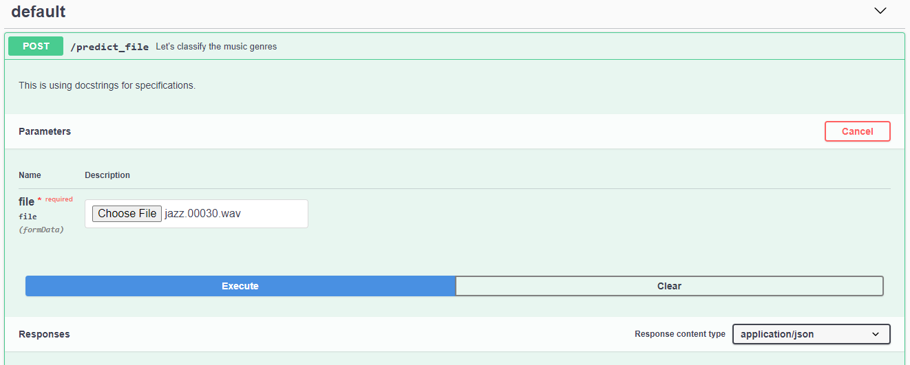
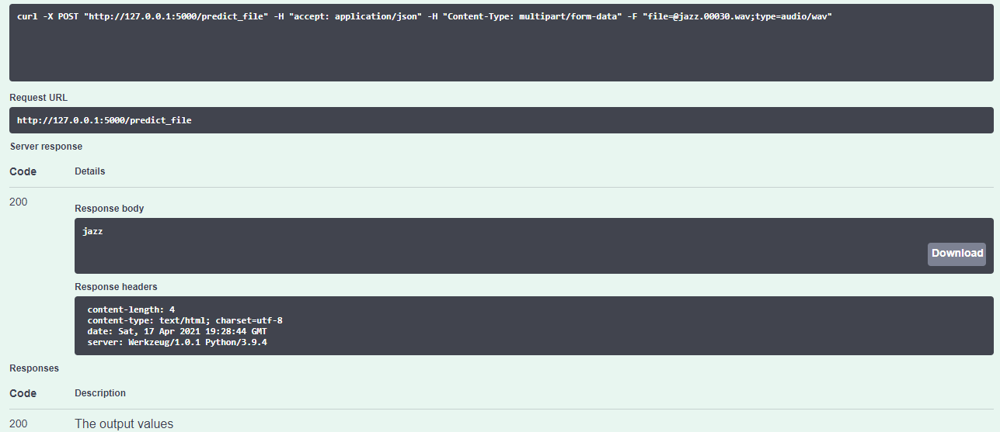

# Music-Genre-Classification
An LSTM based model to classify 10 genres of music using MFCCs as features.

### Deployment
Deployment is done using Flask and the frontend is built using the Flasgger library.
1. Input

2. Output

